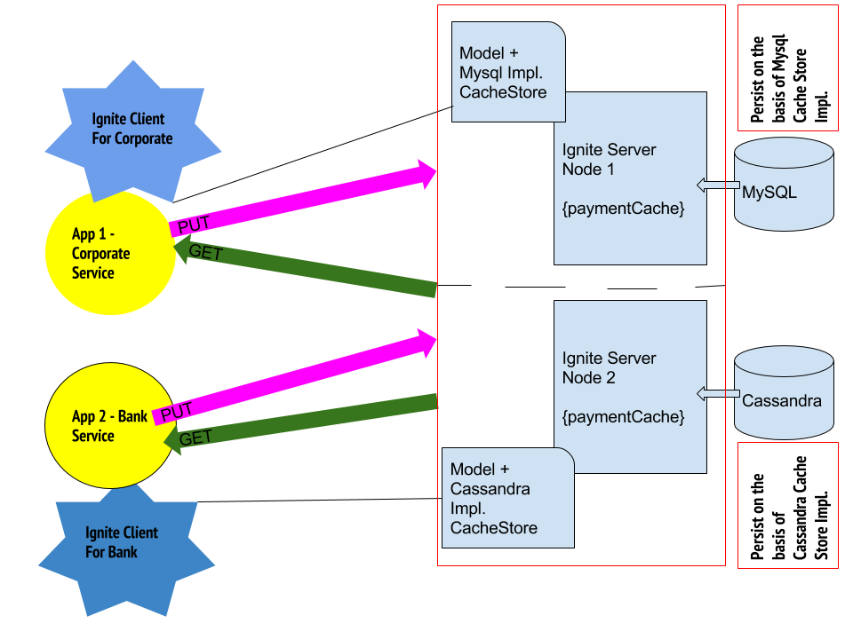

### PHASE-1 : POC Application Architecture using Apache Ignite for READ and WRITE



### Running Application
1. First of all, install gradle and place gradle bin directory in PATH
2. Download or clone https://github.com/developerpapers/POC-Apache-Ignite/ repository
3. Extract if you download as zip file
4. Open terminal in POC-Apache-Ignite directory
5. Prepare database environments on your machine if you prefer docker you can use script inside ./docker folder

```docker
docker pull mysql
docker run --name ignite-mysql -e MYSQL_ROOT_PASSWORD=passwd -d  -p 13306:3306 mysql:latest
```
- Open SQL editor like DBeaver CE and connect mysql using `host: localhost`, `username: root`, `password: passwd`
- Copy text from `./docker/rdbms/mysql/pre-mysql-script.sql` in your sql editor then run script.    


```docker
docker pull cassandra
docker run --name ignite-cassandra -d  -p 9042:9042 cassandra:latest
```

- Open terminal then run `docker run -it --link ignite-cassandra:cassandra --rm cassandra sh -c 'exec cqlsh "$CASSANDRA_PORT_9042_TCP_ADDR"'`
- Copy text from `./docker/nosql/cassandra/post-script.sql` in your cql console editor then run script one by one.    

6. Now we need start applications and ignite nodes. :)
```bash
# Ignite NODE-1 having MYSQL persistence Store
./phase1/phase1-ignite-node1/buildAndRun.sh

# Ignite NODE-2 having Cassandra persistence Store
./phase1/phase1-ignite-node2/buildAndRun.sh

# APP-1 corporate Service - server port = 8888
./phase1/app1-corporate-service/buildAndRun.sh

# APP-2 bank Service - server port = 8889
./phase1/app1-corporate-service/buildAndRun.sh

```
-----------------------TESTING------------------------------------------------------------

### App1 - Corporate Service
 
- Check CURL and also see database data after each command execution to verify cache with database values. 
```
    curl -X POST http://localhost:8888/payment/add
    curl -X GET http://localhost:8888/payment/1
    curl -X DELETE http://localhost:8888/payment/1   
```

### App2 - Bank Service 
- Check CURL and also see database data after each command execution to verify cache with database values.
 (Note: please add one payment by using corporate service before perform action from Bank service)
 
```
    curl -X POST http://localhost:8889/payment/approve/1
    curl -X POST http://localhost:8889/payment/reject/1
```
